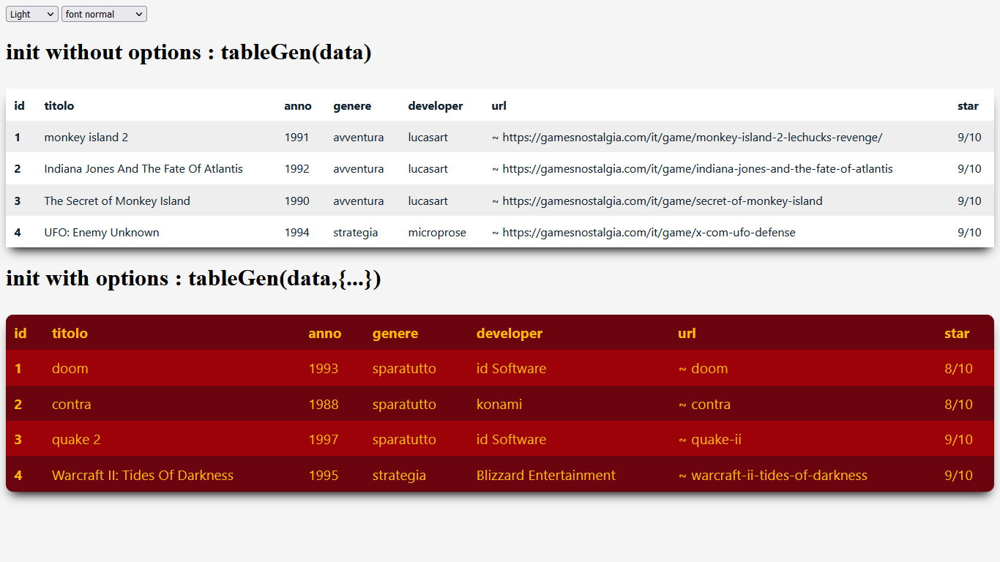

# tableGen 



## [*english*]
## tableGen is an html5 table generator that takes as data source a json type response of type array of objects.
## You can customize the table passing the options: theme, border and fontSize.
## Another peculiarity is the possibility through the *"urlFullName"* property to truncate or not the url names, furthermore all the url will be automatically transformed into links with an initial symbol that distinguishes them.
## getData is a utility function that allows you to fetch json data so that these are then sent as options to the tableGen function.

## [*italiano*]
## tableGen è un generatore di tabelle html5 che prende come sorgente dati una risposta di tipo json di tipo array di oggetti.
## E' possibile personalizzare la tabella a proprio piacimento passando le opzioni: theme, border e fontSize.
## Altra peculiarità è la possibilità tramite la proprietà *"urlFullName"* di troncare o meno i nomi delle url, inoltre tutte le url verranno trasformate automaticamente in link con un simbolo iniziale che le contraddistingue.
## getData è un funzione d'utility che permette di prelevare dei dati json in modo che questi vengano poi inviati come opzioni alla funzione tableGen. 

### *syntax*:
``` javascript
tableGen(data, {
idTableContainer: 'my-table',
urlFullName?: false,
theme: 'pink',
border: 'rounded',
fontSize : 'normal'
```

---

### *params*:

``` javascript
    /*
    @param data: object[] [*empty array]
    @param options? : object [*empty object]
        @param idTableContainer?: string [*tablegen]
        @param urlFullName?: Boolean [*true|false]
        @param theme?: string [*light|dark|red|orange|green|khaki|blue|azure|violet|pink]
        @param border?: string [*flat|rounded]
        @param fontSize?: string [*normal|esmall|small|large|responsive]

        (* = default value)
    */
```

